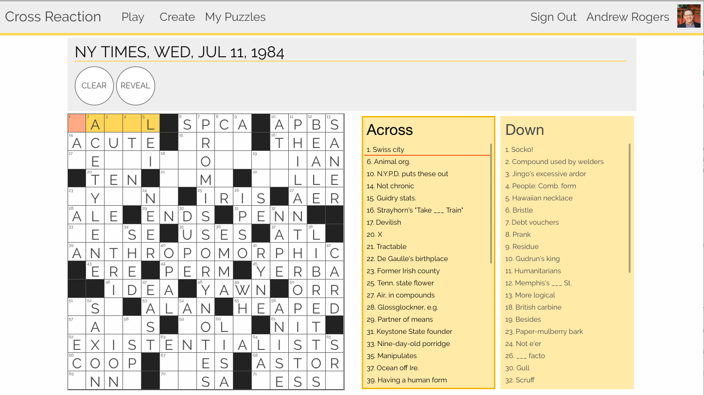

# Cross Reaction
Cross Reaction is app for solving and building crossword puzzles. 

This app was originally build as "breakable toy" project at Launch Academy in 2017. The [original version](https://github.com/andrewprogers/crossword-react-on-rails) (no longer functioning) was a Rails app with a React frontend. I rebuilt the project in 2024 with the goal of learning a similar skillset in python. Additionally the frontent has been migrated to a more modern React style, using hooks and functional components, as well as a client-side routing library. 
[Try it out for yourself! ✏️](https://cross-react.uw.r.appspot.com/)

#### Features:
- Solve crosswords in a simple interface. Use the keyboard to navigate quickly!
- Create custom puzzles with our editor. If you're feeling stuck, use the match feature to find words fitting a pattern.
- Publish puzzles and share them with your friends
- Signed-in users have their solutions and draft puzzles saved automatically

## Deployment details
This project is deployed on Google cloud as an app engine as described by the app.yaml file
The main service run by the app is the python api, run with gunicorn, while the frontend is built at deployment time and served as static files.
The project runs on a postgres database hosted by Neon

## Thanks
- I'd like to thank [datamuse](http://www.datamuse.com/api/) for offering their API without registration, it is excellent and simple to use!
- This project was created as a breakable toy during my time at [Launch Academy](https://www.launchacademy.com/). I owe a huge debt everyone there.
